# Getting Started with Vodka

Note: this document is a work in progress!

## Your First Doc

So, you've installed Vodka, and you've loaded it up in a browser, and you're staring at a completely empty browser window.

A blank sheet of paper.

If you're a writer like me, seeing a blank sheet of paper can evoke all sorts of emotions: sometimes fear and insecurity, but also the excitement of unrealized potential. So let's start filling up this digital paper with words, shall we?

Grab your keyboard and just start typing. You should be able to type lines of text, hit enter to go to the next line, hit backspace if you make a mistake... essentially perform many of the basic actions you would normally perform in a word processor.

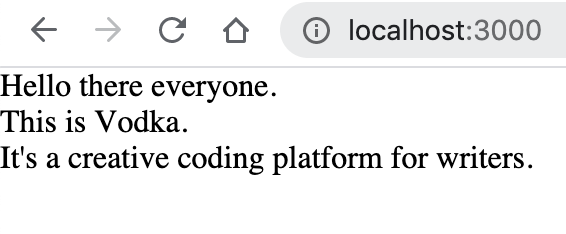

Once you've filled up the screen with some language, do me a favor and escape key. I want to show you something cool.

## Exploded Mode

Have you ever wanted to open up the hood of your word processor and tinker with what it's doing? Exploded mode in Vodka is how you do that. Exploded mode shows the guts of your Vodka doc -- the data structures and information that is underlying what you're seeing.

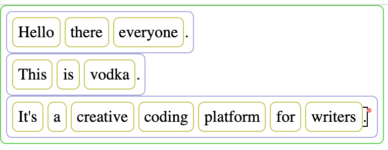

You can see that the letters you typed are surrounded by boxes. Words
are enclosed in yellow boxes, lines are enclosed in blue boxes, and the entire document that you typed is in a green box. These boxes are called _nexes_. Actually, the letters you typed are nexes too,
along with everything else you will see and work with in Vodka, and
the boxes are more properly termed _nex containers_. But I won't bog you down with too much terminology quite yet.

If you click around with the mouse now, you will see that not only can you select letters, you can also select the different boxes. You can still use the arrow keys to go to the previous or next letter, like you could before you exploded the doc, but you also might be interested to know that you can use the `tab` and `shift-tab` keys to navigate down or up (respectively) in this nested hierarchy of boxes. Before going forward, go ahead and try this out.

## Writing Some Code

Now that you can see all the data in your document laid out in visibly, and you can navigate through it,
you are in a position where you can actually write some code. Let's do that. Click on the word vodka (so that the yellow box around it is selected) and hit the shift key twice (press it and
release it without typing any other keys). You should see a red dotted outline appear around the word. Now type the `~` key.

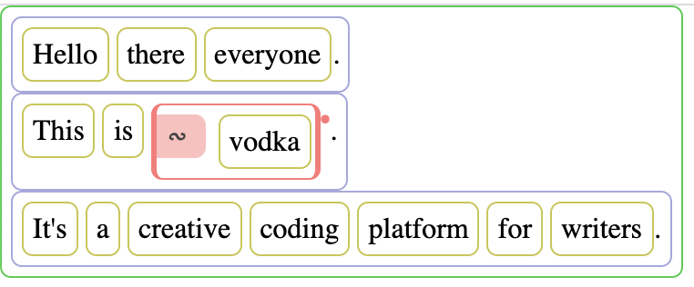

This has spawned a new type of nex container, and it's surrounding the word you were interested in. This nex container is called a _command_. It is a way of running some code on the data (the words) in your Vodka doc.

There are many commands, and commands can be put inside other commands, or run in sequences and loops. This is how you write code in Vodka! In this case, since it's your first program, we are just going to run one command. Type the word "first" and hit `enter`.

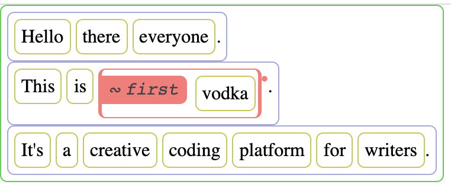

You've written a little code. This command, `first`, extracts the first
element of whatever nex container you pass into it. But how do you run this code? Well, with Vodka, we don't have to switch windows or go run our code in some other environment. We can run our code right here, in the same place where we've written it. Make sure your command is still selected (it will be red if it's selected) and hit the enter key.


And look at that! You've run this command, and it did what you asked it to do -- it extracted the first letter of the word vodka, and replaced the contents of the doc at that location with the result. Congratulations, you have taken your first few baby steps toward writing
digital literature in Vodka.

## Getting Into The Details

### Nex Types

Vodka has a number of different types of lists (or _nex containers_) and atoms (or _value nexes_). These are listed below, along with the hotkey that you use to create one of these nexes.

| Nex      | Hotkey | Example | Description |
| -------- | ------ | ------- | ----------- |
| doc      | { | 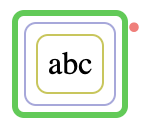  | a container for a multiline fragment of writing (like a page of text) |
| line     | [ | 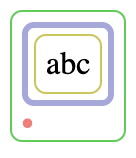  | a container for a line of text that runs horizontally across the page |
| word     | ( | 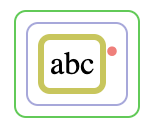  | a container for a string of letters that form a word |
| letter   | A-Z, a-z |   | an individual letter that can take part in forming a dictionary word |
| separator   | ,:;- and others | 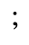  | a space, punctuation mark, or other typographic character that either separates words or isn't considered part of the word it's next to |
| command  | ~ | 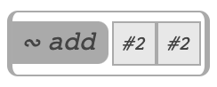 | a call to a function (defined elsewhere), into which you can pass arguments, which will return some result value |
| boolean  | ! | 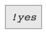 | an object that can be either true or false ("yes" or "no") |
| symbol   | @ | 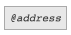  | a variable name pointing to some stored data |
| integer  | # | 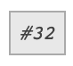  | a mathematical integer (-2, -1, 0, 1, 2) |
| string   | $ | 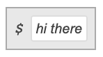  | a series of any arbitrary text characters, with no formatting or layout information |
| float    | % | 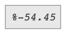  | a mathematically rational number (23.54) |
| nil      | ^ | 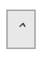  | a "nothing" object
| lambda   | & | 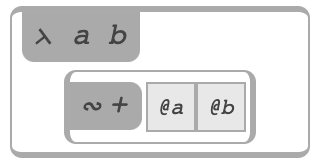  | a definition of a function that performs some operations on arguments and returns a result |
| expectation  | * | 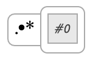  | an asynchronous computation (i.e. a value that can update by itself in the background) |
| org      | ) | 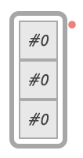  | a generic container that is not associated with a written document and is only used in code |

Typing the hotkeys listed above should create the appropriate nexes in most cases where you would expect them to. However, it's important
to be aware that in Vodka, keyboard input is "contextual."
Depending on what the currently selected nex is, typing hotkeys
might do different things. So, if you're inside a doc, typing
an exclamation point might give you a separator, because you
are probably typing a sentence and want to end it in an
exciting way! On the other hand, if you're inside a command,
then typing an exclamation point will create a boolean nex. [^1] If you're ever in a situation with Vodka where Vodka isn't creating the nex type that you want it to, you should be able to copy and paste a nex of any type from any location into any other location. If that doesn't work, please file a bug describing the problem you're having.

### Editors

Most code-type nexes have some sort of value. Integers have a numeric value, strings have characters, and commands have a command name that is meant to be executed. When you first create a nex, it starts out in "editing" mode, which means that letters you type will change the value of that selected nex.

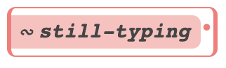 

You can tell that a nex is being edited because it will be selected (red) but the selected color will be a muted red (pink) instead of a dark red. You can press enter when you're done editing, but Vodka will also attempt to guess when you're done editing, so if you type some character that is not allowed in the current editing context, Vodka will assume you're done editing and exit the editor.

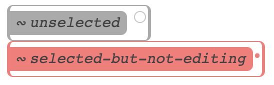 

TODO: finish this section

## Origins

Vodka is based on a family of programming languages called Lisp. If you're not familiar with Lisp, don't worry about it... I'll try to tell you all you need to know here.

Lisps allow you to build a program from a small set of syntactic elements. There are essentially two types of elements: atoms and lists. Lists are indicated by parentheses and can contain other lists or atoms, while atoms are anything else that the language can express:

```
(23 43 ("hello" 4.4))
```

When you run a lisp program, lists are "evaluated", which means that the interpreter looks at the first item in the list, and looks up a command that corresponds to that name, and executes it. For this reason, mathematical operations in Lisp programs look a little strange -- the operator comes before the operands:

```
(+ 2 (* 5 6))
```

In most programming languages, this would just be written `2 + (5 * 6)`. The classic Lisp programming paradigm involves using small functions that call themselves recursively. For example, this program gets the first element of a list that is less than zero:

```
(defun find-negative (list)
  (let item (first list))
  (if (< item 0)
    item
    (find-negative (rest list))))
```

This program defines a function called `find-negative`. You pass it a list. The first thing this function does is grab the first item from the list and store it in a variable called "item". Then it tests the item to see if it's less than zero. If it is, it returns it. Otherwise, it calls the find-negative function on the "rest" of the list, i.e. the remaining items in the list (minus the first one).

This function has a bug. Do you think you can find it? What happens if the list is empty?

Vodka is a Lisp, but instead of parentheses, it uses boxes. The yellow boxes around the words you typed before? Those are the equivalent of parentheses in Lisp.

[^1] This is currently not working, see https://github.com/eeeeaaii/vodka/issues/77