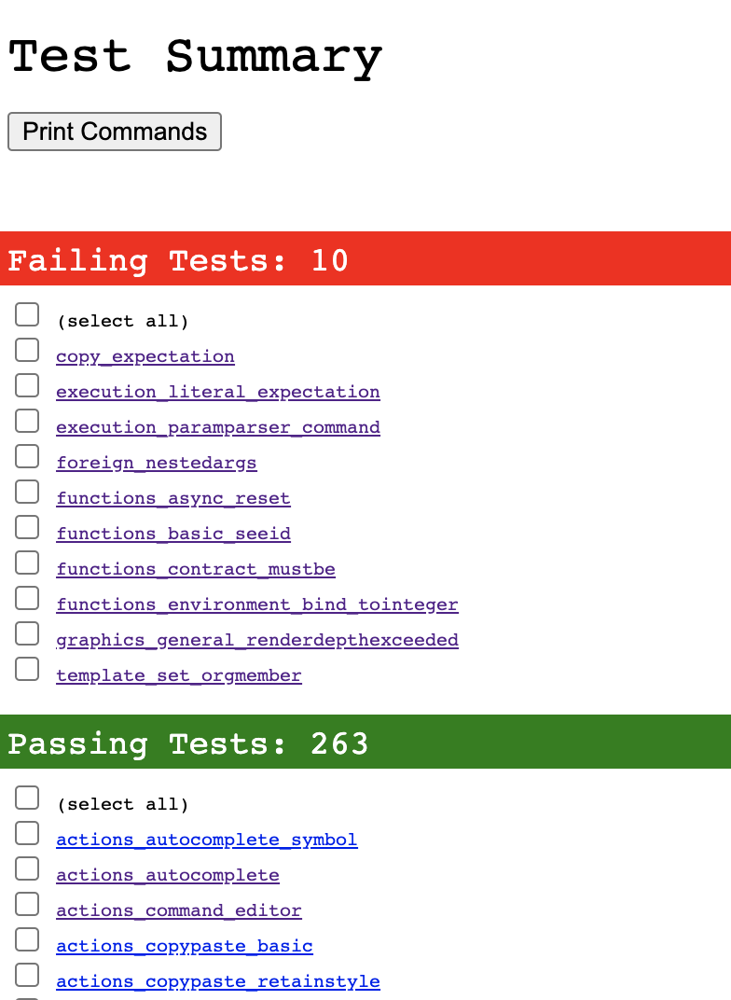
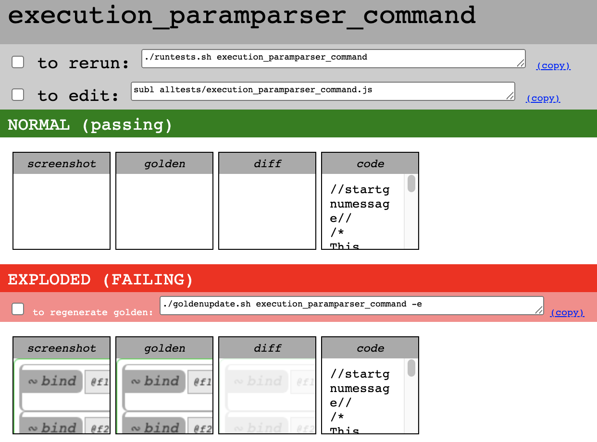

# Contributing How-To

## Update: March 2022
I've changed what the escape key does, which will have effectively broken all the tests. I'll be fixing them eventually but I'm planning to rely less on screenshot tests for things that don't need screenshots.

Also: generating the parser requires the dev version of pegjs. Install it this way:

```
npm install -g pegjs@0.11.0-master.b7b87ea
```

## Introduction

Vodka is implemented in plain vanilla JavaScript with no frameworks,
mostly for performance reasons. I have started slowly adding [JSDoc](https://jsdoc.app/) comments, so there may be a time when it can be ported to TypeScript. It uses ES6 modules, and there is a parser that is created using [PEG.js](https://pegjs.org/). There is a test framework written in [Node](https://nodejs.org/), with some bash scripts. The test framework depends on [puppeteer](https://github.com/puppeteer/puppeteer) and [handlebars](https://handlebarsjs.com/). To run the tests, you will need to have [imagemagick](https://imagemagick.org/index.php) in your $PATH. Issues are logged [in the github issues tab for this project](https://github.com/eeeeaaii/vodka/issues).

## The Source

There are four main parts of the source:

```
native
server
src
testing
```

The `native` tree is legacy code that you should probably just ignore. This has been retained from the original C# version of Vodka that I built back in the aughts.

The `server` folder contains the actual Javascript code that runs the Vodka environment in your browser. It also contains the Node webserver.

The `src` folder contains the parser.

The `testing` folder contains the test framework.

## How to Contribute

The process for contributing would be something like this:

1. find a bug (bugs are logged in the Issues tab right here in github)
1. if the fix isn't trivial, discuss on [vodka-contributors](https://groups.google.com/g/vodka-contributors)
1. sync to head
1. write the fix
1. try out your fix in Vodka to see if it works
1. if it works, record a new test using the test recording framework
1. run all the tests and make sure you haven't broken anything
1. if all tests are passing, commit your code

Running the tests is a super important part of contributing, so the rest of this guide will mostly discuss how to do that.

## Running the Tests

Running the tests is as simple as cding into the `testing` folder (inside the vodka root) and running `runtests.sh`. The tests will take a while to finish, maybe around 15 minutes as of the time of writing this (10/15/2020), because each test launches the browser, performs some actions, takes two screenshots and saves them, then quits.

When the tests are finished running, you will find an HTML file called `testoutput.html` in the `testing` folder. Just pull up that file in a browser using a `file://` url. The tests will be listed at the top, failing tests first, then passing test.



You can click on any test name to go to the details for that test run. Each test run does a screenshot comparison in exploded mode and normal mode (see [Getting Started with Vodka](./GETTINGSTARTED.md) for more info about what these terms mean). Test output includes the actual screenshot taken, the correct (golden) screenshot, a visual diff between the screenshots, and the test code.



Usually tests will fail due to a screenshot comparison failure. If the test failed because the test framework crashed, instead of seeing the screenshots, the test output will be here.

The test output file also contains terminal commands you can run to do
various things, like launch files in an editor, or update goldens.
Each of these terminal commands has a checkbox in front of it.
What you can do is this: go through the test results and check off
any commands you want to run at the terminal. When you're done,
click the "print commands" button at the top of the page.
You can then copy and paste the commands into your terminal or
into a script for running at the command line.

Tests can also be run in "show" mode, which means that
a visible ("non-headless") chrome instance will launch, so you can
actually watch the test operations as they are performed.
When running in "show" mode, the test will take longer,
because the framework pauses between operations -- so your puny
human brain
can keep up with what the computer would normally do at
lightning speed. If you want to pause,
resume, slow down
or speed up the test, you can do that by:

1. find the terminal window that's running the test and focus it
1. type the enter key to pause the test
1. type a number (1, 2, or 3) to resume the test at the given speed
1. type enter again to pause again, if desired


## Fixing a Broken Test

If a test breaks, you should first assume that any new code you've written has done something wrong. However, if you've done your due diligence and it looks like nothing is wrong, it can be the case that your change has some side effect that causes unrelated test goldens to need to be updated (for an example, [see this issue](https://github.com/eeeeaaii/vodka/issues/29)). This is especially true in cases where you change anything regarding the way nexes are rendered to the screen.

There are scripts in the testing folder that update the goldens. Before updating the goldens, you should make sure that the tests pass without your change. If you want to be extra sure, you can create an experiment flag in globalappflags.js and guard your change with that.

Be careful with golden updates: they can be the source of broken
functionality going unnoticed for a long time.

## Recording a Test

Vodka comes bundled with a test framework that uses headless chrome to automate test actions and take screenshots. Running the tests generates an output file containing all tests results and/or failures. Here's how you create a new test:

1. Decide what you are going to name this test. For inspiration, look at [this spreadsheet of all the existing tests](https://docs.google.com/spreadsheets/d/10YoCxOf9UnRocStA2-xbXG1aurN-xajhfoZPDn0IHzw/edit#gid=459575693). Try to follow the naming convention as best you can. If you get it wrong, tests can always be renamed of course.
1. Load up Vodka in a browser.
1. Press the escape key three times before typing ANYTHING else.
1. If the first three keystrokes Vodka receives are ESC, it will go into test recording mode. Everything you do from now on will be recorded.
1. When you've finished recording your test, hit ESC again.
1. You should see a dialog box pop up showing you all the keystrokes that were recorded. You can just dismiss this. NOTE: from now until you get to step 10, do not copy anything into the system clipboard -- your test actions are waiting there.
1. In a terminal, CD into the `testing` directory under the vodka root.
1. Run `capturetest.sh`, passing it the name of your new test. If you forget to type the test name, it will prompt you.
1. Type in a description of the test. Two or three sentences is probably sufficient but a word or two probably isn't.
1. `capturetest.sh` will grab the test actions directly from the system clipboard and create a new test file, and then it will run the test to generate a new golden