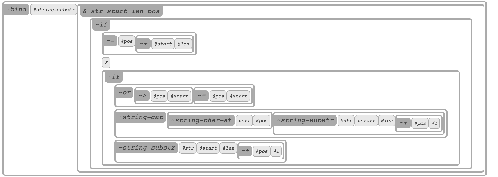

# Vodka

## Introduction

Vodka is an experiment in implementing something that I'm tentatively calling a "representational programming language." There are several ways to think about what this means, none of which are entirely complete:

* It's a debugger in which you can write or modify code and recompile pieces of your program as you go
* It's a tool that you can use to navigate the in-memory representation of a program (its AST or IR, in compiler-speak)
* It's a Lisp where boxes are used instead of parens
* It's a tree of nodes, where leaf nodes map to Lisp atoms, and inner nodes map to Lisp lists
* It's an IDE in which you "navigate through" your code as opposed to typing characters like you would on a typewriter
* It's a visual programming language that "doesn't have to be" visual but could be read aloud (for example)
* It's a REPL on steroids
* It's a "reified" programming language where instead of writing code about a button, the button itself is quite literally embedded in your code
* It's a programming language that has an exernal representation that is as close as possible to the internal representation
* It's a programming language you could operate with a game controller, or with gestures on your phone, or with assistive devices

Here is a screenshot:

In the near term I am planning to use Vodka for livecoding music and visuals. I feel that by allowing you to directly manipulate media objects, Vodka could provide an immediate and direct environment for doing creative work with code, 
The hope is that this will
allow you to be in an intuitive, spontaneous mental space.
In the longer term I think Vodka could have a place as a general-purpose programming
language.

Current work is being done on a reference implementation of Vodka that runs in the
browser and which has built-in 
types to allow you to create text-based works/graphic design.
Planned work includes adding objects for modular synthesis of sound.

## Installing

Using Vodka requires that you start a server on your local machine, and then direct your browser to that local URL. Do a git pull, and then run:

	cd server
	./startserver.sh

This should start up a server at ``localhost:3000``. Load that URL in your browser
and you will see a blank canvas.

## Getting Started

One way to get started is probably just to start typing words. You will see that
you can use vodka in a way similar to a word processor: type a few words, hit
enter to make a new line, etc.. When you do this, you are actually creating
atoms and lists, but you can't see them yet.

### Exploded vs. Normal mode

Typing "escape" will toggle between Exploded and Normal mode. Exploded mode shows you in depth all the code and objects that exist in your current tree:
now you will see rectangles that represent quoted lists, and letters that are
atoms. Normal mode is "display" mode, or the way this program should look
to users (or to your audience, if you are livecoding).
 All code is invisible when you're in Normal mode -- the only data objects that are visible are media objects. If you type words in
Exploded mode, you'll see that Vodka will automatically compartmentalize and divide
your typed characters into a sensible data structure.

### The Selected Object

At any given time, there is only one object selected in Vodka. There is no multiselect, and probably never will be (because single-select is much more extensible
to alternative inputs like voice commands). The selected object will be more clearly visible in exploded mode, but if you select letters in Normal mode, you will see a brief flash of a cursor. To operate on multiple items at a time, they have to be inside some kind of container object or list that is selected.

Adding new objects when an object is selected doesn't replace the selected object.
Instead they typically appear after the selected object as a next sibling.
Although in some cases you will see an insertion point appear,
these will hopefully be removed in a future version. The problem with insertion points
is that they go against the philosophy of a representational programming language: they are things you see
on the screen that are not actually part of the running program.

The standard copy and paste commands work as you would expect: Cmd-X, Cmd-C, and Cmd-V.

### Navigating Around

You can move around with the arrow keys (but they might do different things depending on what's selected, see "Key Funnels", below). Generally, tab should go "in" (i.e. deeper into a nested set of lists) and shift-tab should come back "out" (back up to the parent node). Clicking also works to change the selected object, but there is no drag and drop. Inserting a new object when an empty list
is selected typically inserts it as the first child, but if a non-empty
list is selected, inserting a new object typically inserts it as the next-sibling
after the selected list.

### Key Funnels

When you type on the keyboard, different things may happen depending on what the selected object is. Each type of object has all keyboard input "funneled" to it when it is selected. Depending on what it is, the (hopefully) intuitive thing will happen.

The default key funnel is the "word processor" (text based) key funnel that you've
already been experimenting with.

### Writing Actual Code

Regardless of what key funnel is currently in operation, there are certain keys that are permanently mapped to certain functions. These are along the top row of your keyboard:

| Key | Creates |
| --- | ------ |
|  ~  | a command (an unquoted list or form that can be executed) |
| !   | a boolean |
| @   | a symbol |
| #   | an integer |
| $   | a string |
| %   | a float |
| ^   | an instance of the 'nil' data type |
| &   | a lambda expression |

Each of these "initiator" keys creates an object of this type. When voice commands are eventually implemented,
there will be commands that map to these keys (saying "new integer", for example, would be equivalent to
typing the "#" key.

When an object is created it is immediately selected, so it keyfunnel will then dictate what keystrokes do (for example, currently strings allow you to edit the contents of the string by typing "shift-enter", while a commands will execute if you type that -- though
I'm not entirely sure that's the right behavior). The
navigation commands are largely the same for commands or lambdas.

You can also insert different types of lists -- these initiator keys may change also:

| Key | Creates |
| --- | ------ |
| (  | a word (vanilla list) |
| [   | a "line" list |
| {   | a "document" list |
| <   | a "zlist" (an experimental list that stacks toward you in the screen's z-order) |

The document list keyfunnel nicely formats typed characters in a way that a
word processor does.

The main way you write code is to create commands, and then
evaluate them by selecting them and typing shift-enter.

## Implementation

Vodka is implemented in very plain vanilla JavaScript. It is essentially a prototype and I'm developing it rapidly, so it's not production-ready or secure. There is a facility for recording keystrokes and user actions, and then saving them out to a file to be played back in a test. The test framework uses headless chrome to automate the tests, and the "handlebars" markup framework to generate the test output file, so you'll have to npm those in if you want to run tests or create them. To actually run the server, you just need Node itself, nothing else.

## Testing

A comprehensive set of automated tests are in the "testing" directory. These were
recorded from interactive Vodka sessions in the browser. All tests are screenshot
tests. In order to run the test suite, you will need install a few node packages. Run
the following in the "testing" directory:

* npm i puppeteer
* npm i handlebars

Also, you will need to install imagemagick (the "magick" binary should be in your $PATH). For now, I am not storing test goldens in the repository, so if you
do a git pull and want to do some work, first generate the goldens so you have
a reference and you know if you've broken something (go into the testing directory
and type "./runtests").

## Misc Notes

Vodka is pre-alpha and, at the time you are reading this, many things are probably broken or not working. I have a road map that takes me into 2022, so there's a fair amount of work to do. If you're interested in contributing, please get in touch with me at eeeeaaii@gmail.com.

## License

All code is open source licensed under the Greater GPLv3.