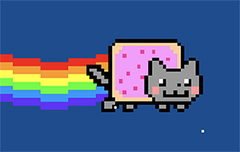

# Vodka

## Introduction

Vodka is an integrated, Lisp-based programming environment for creative coding and/or livecoding. Probably the best way to think about it is that it's a visual REPL. You actively write code in the user interface of the program itself, execute that code, and then you can copy and paste it around on the screen as you see fit.

To write a program in Vodka, you manage a tree of data objects
(in compiler parlance the "intermediate representation" or AST), all of which are Lisp S-Expressions, and which can be passed as data to functions. In addition to traditonal data types such as symbols, integers, and strings, Vodka has some (and will have more) special data types that represent different "media objects" you might want to work with.

These media objects are meant to, as closely as possible, actually *be* the things, as opposed to *talking about* the things. So instead of looking at code and seeing something like

	var image = new Image("nyan cat");
	crop(image, 50, 50);

The objective is for you to be looking at the code and seeing something conceptually like this:

```(crop `````` 50 50)```

Though in reality it looks more like this:


By allowing you to directly manipulate media objects, Vodka seeks to provide an immediate and direct environment for doing creative work with code:
the intent is to get out of the cycle of write-compile-run 
and to instead feel like you are just editing a program directly,
as it's running. For creative coding, the hope is that this will
allow you to be in an intuitive, spontaneous mental space,
however there are plenty of applications outside of just livecoding.
Imagine a drummer verses a composer: you could be *playing* a program
rather than writing it.

The current implementation of Vodka runs in the browser and has built-in 
types and graphic design features to allow you to create text-based works.
However, more media objects are planned for future versions, and will be integrated in the same visual REPL, so that your code could operate simultaneously on, for example, images or sounds.

## Installing

Using Vodka requires that you start a server on your local machine, and then direct your browser to that local URL. Do a git pull, and then run:

	cd server
	./startserver.sh

This should start up a server at ``localhost:3000``. Load that URL in your browser
and you will see a blank canvas.

## Getting Started

The best way to get started is probably just to start typing words. You will see that
you can use vodka in a way similar to a word processor: type a few words, hit
enter to make a new line, etc.. When you do this, you are actually creating
atoms and lists, but you can't see them yet.

### Exploded vs. Normal mode

Typing "escape" will toggle between Exploded and Normal mode. Exploded mode shows you in depth all the code and objects that exist in your current tree:
now you will see rectangles that represent quoted lists, and letters that are
atoms. Normal mode is "display" mode, your actual artwork. All code is invisible when you're in Normal mode -- the only data objects that are visible are media objects. If you type words in
Exploded mode, you'll see that Vodka will automatically compartmentalize and divide
your typed characters into a sensible data structure. This can, of course, be modified
by code.

### The Selected Object

At any given time, there is only one object selected in Vodka. There is no multiselect, and probably never will be (because single-select is much more extensible
to alternative input modalities like voice commands). The selected object will be more clearly visible in exploded mode, but if you select letters in Normal mode, you will see a brief flash of a cursor. To operate on multiple items at a time, they have to be inside some kind of container object or list that is selected.

Adding new objects when an object is selected doesn't replace the selected object.
Instead they typically appear after the selected object as a next sibling.
Although in some cases you will see an insertion point appear,
these will be removed in a future version. The problem with insertion points
is similar to the problem with multiselect: it creates problems with
alternate input modalities (it becomes harder for the computer to answer the
question "what is
currently selected now").

The standard copy and paste commands work as you would expect: Cmd-X, Cmd-C, and Cmd-V.

### Navigating Around

You can move around with the arrow keys (but they might do different things depending on what's selected, see "Key Funnels", below). Generally, tab should go "in" (i.e. deeper into a nested set of lists) and shift-tab should come back "out" (back up to the parent node of the whole doc tree). Clicking also works to change the selected object, but there is no drag and drop. Inserting a new object when an empty list
is selected typically inserts it as the first child, but if a non-empty
list is selected, inserting a new object typically inserts it as the next-sibling
after the selected list.

### Key Funnels

When you type on the keyboard, different things may happen depending on what the selected object is. Each type of object has all keyboard input "funneled" to it when it is selected. Depending on what it is, the (hopefully) intuitive thing will happen.

The default key funnel is the "word processor" (text based) key funnel that you've
already been experimenting with.

### Writing Actual Code

Regardless of what key funnel is currently in operation, there are certain keys that are permanently mapped to certain functions. These are along the top row of your keyboard:

| Key | Creates |
| --- | ------ |
|  ~  | a command (an unquoted list or form that can be executed) |
| !   | a boolean |
| @   | a symbol |
| #   | an integer |
| $   | a string |
| %   | a float |
| ^   | an instance of the 'nil' data type |
| &   | a lambda expression |

Once an object of that type is created, its own keyfunnel will dictate what keystrokes do while it is selected (for example, strings allow you to edit the contents of the string by typing "shift-enter", while a commands will execute if you type that). The
navigation commands are largely the same for commands or lambdas.

You can also insert different types of lists:

| Key | Creates |
| --- | ------ |
| (  | a word (vanilla list) |
| [   | a "line" list |
| {   | a "document" list |
| <   | a "zlist" (an experimental list that stacks toward you in the screen's z-order) |

The document list keyfunnel nicely formats typed characters in a way that a
word processor does.

To evaluate a command, select it and type shift-enter.

## Implementation

Vodka is implemented in very plain vanilla JavaScript. It is essentially a prototype and I'm developing it rapidly, so it's not production-ready or secure. There is a facility for recording keystrokes and user actions, and then saving them out to a file to be played back in a test. The test framework uses headless chrome to automate the tests, and the "handlebars" markup framework to generate the test output file, so you'll have to npm those in if you want to run tests or create them. To actually run the server, you just need Node itself, nothing else.

## Testing

A comprehensive set of automated tests are in the "testing" directory. These were
recorded from interactive Vodka sessions in the browser. All tests are screenshot
tests. In order to run the test suite, you will need install a few node packages. Run
the following in the "testing" directory:

* npm i puppeteer
* npm i handlebars

Also, you will need to install imagemagick (the "magick" binary should be in your $PATH). For now, I am not storing test goldens in the repository, so if you
do a git pull and want to do some work, first generate the goldens so you have
a reference and you know if you've broken something (go into the testing directory
and type "./runtests").

## Misc Notes

Vodka is pre-alpha and, at the time you are reading this, many things are probably broken or not working. I have a road map that takes me into 2022, so there's a fair amount of work to do. However, I intend to get it minimally functional for livecoding/code-poetry and writing basic on-the-fly graphic design and layout code by early 2020. If you're interested in contributing, please get in touch with me at eeeeaaii@gmail.com.

## License

All code is open source licensed under the Greater GPLv3.